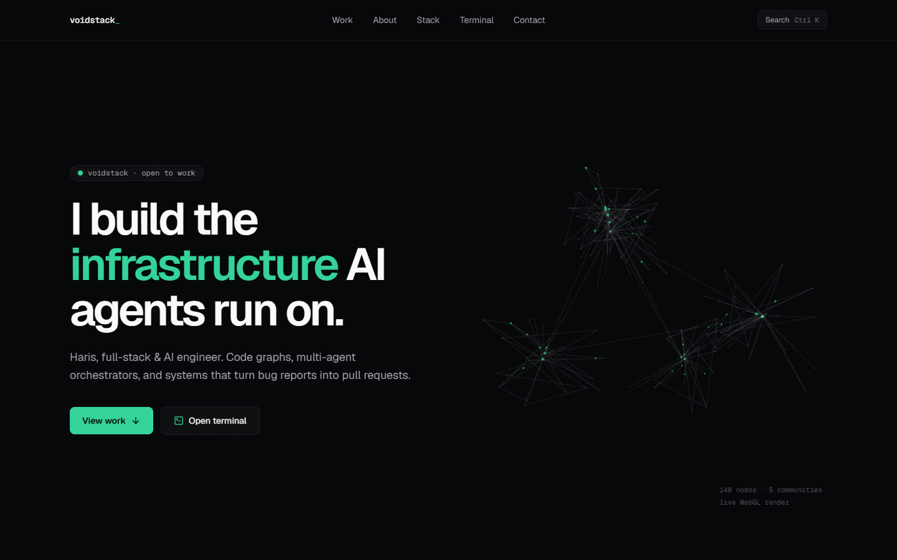
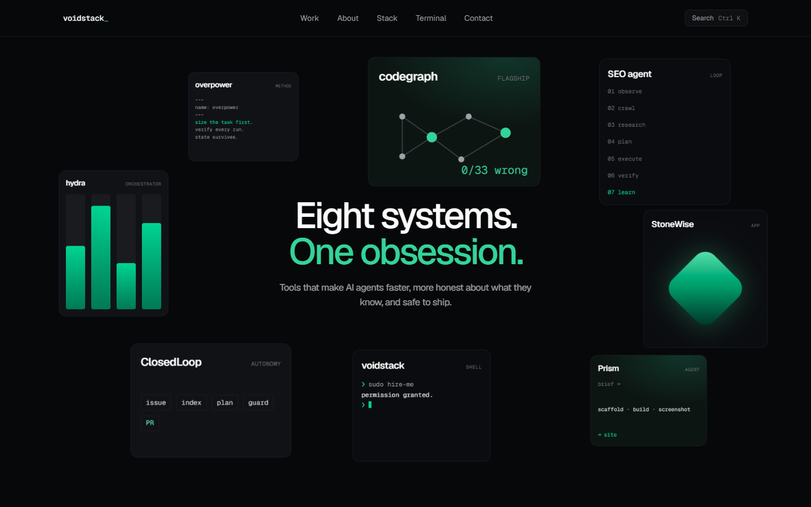

# voidstack

Portfolio of Haris (voidstack), full-stack & AI engineer: code graphs, multi-agent orchestrators,
and systems that turn bug reports into pull requests.

**Live:** https://hariskhan2010.github.io/voidstack/




## What's on the page

- **Hero:** a Three.js code graph (communities, call edges, signals moving along them), lazy-loaded after the text paints.
- **Stats:** commit heatmap and counters generated from real git history (`npm run collect-activity`).
- **Project deck:** eight project cards that scatter on scroll ([StackSpread](https://vault.hyperiux.com), adapted).
- **codegraph:** the flagship, with its benchmark against graphify.
- **How I build:** four principles, each taken from a real project.
- **Stack orbit**, an **interactive terminal** (`help`, `open hydra`, `sudo hire-me`), and a **⌘K / Ctrl K** palette.

The build prerenders the whole page to static HTML, so the content is readable without JavaScript
(crawlers, link previews, AI tools); the browser then hydrates it.

## Stack

React 19, Vite, Tailwind v4, Framer Motion, Three.js, [Lightswind UI](https://lightswind.com) components.
Designed and built with [Prism](https://github.com/hariskhan2010/prism), an OpenClaw design agent.

## Run it

```bash
npm install
npm run dev      # http://localhost:5173
npm run build    # client build + prerender into dist/
```
